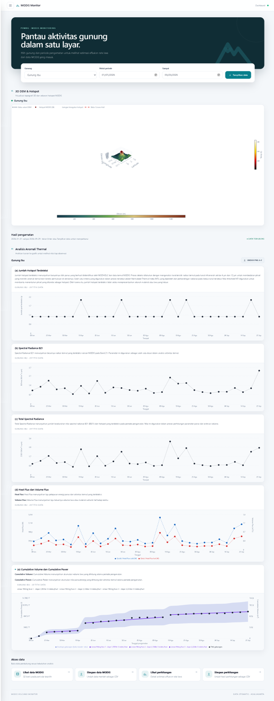
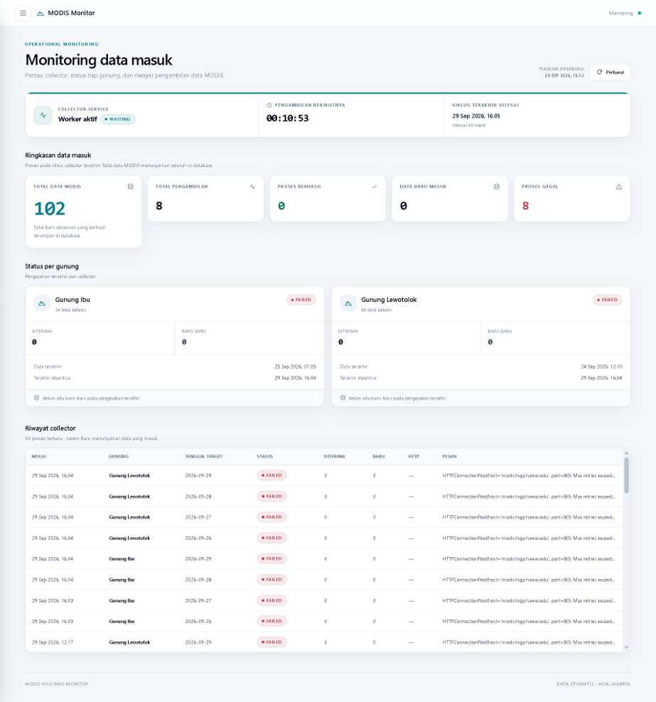
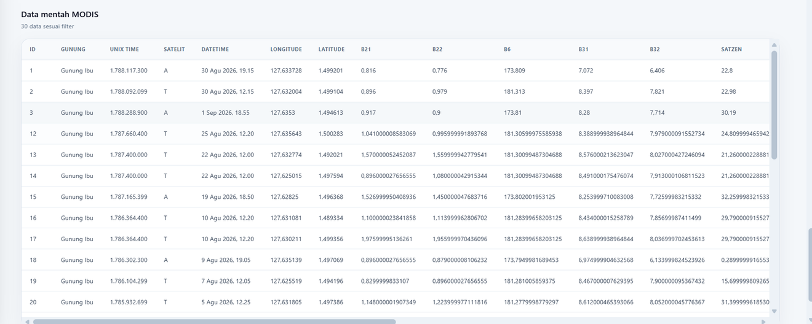
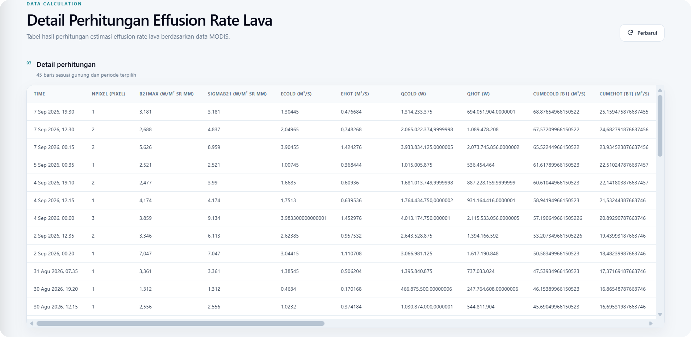
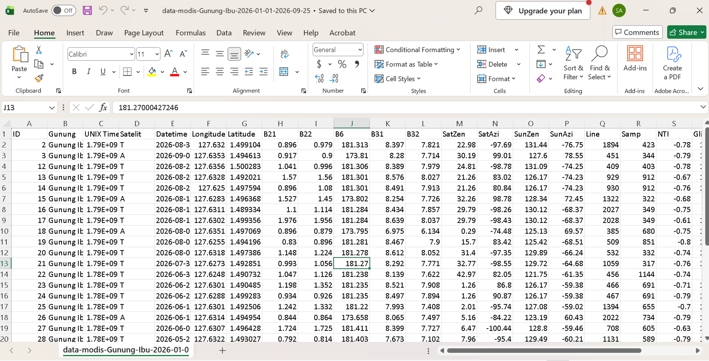
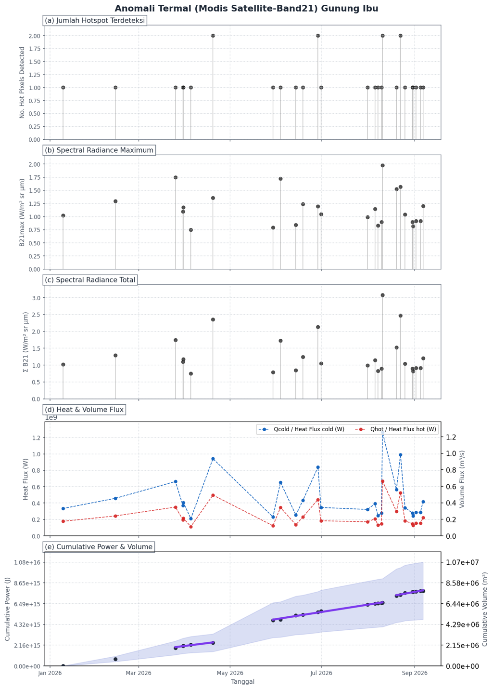
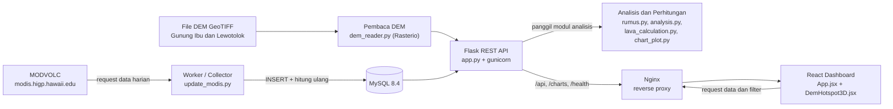

# Sistem Pemantauan Hotspot MODIS dan Estimasi Volume Lava

**Studi Kasus: Gunung Ibu dan Gunung Lewotolok**

Sistem berbasis web untuk memantau hotspot MODIS dan mengestimasi keluaran lava pada dua gunungapi di Indonesia. Dikembangkan sebagai bagian dari kegiatan Kerja Praktik di Pusat Vulkanologi dan Mitigasi Bencana Geologi (PVMBG)dengan supervisi oleh Dr. Devy Kamil Syahbana.

---

## Daftar Isi

- [Pengenalan Project](#pengenalan-project)
- [Latar Belakang Singkat](#latar-belakang-singkat)
- [Tujuan Sistem](#tujuan-sistem)
- [Fitur Utama](#fitur-utama)
- [Preview Sistem](#preview-sistem)
- [Arsitektur Sistem](#arsitektur-sistem)
- [Alur Sistem](#alur-sistem)
- [Teknologi yang Digunakan](#teknologi-yang-digunakan)
- [Struktur Project](#struktur-project)
- [Cara Menjalankan Sistem](#cara-menjalankan-sistem)
- [Dokumentasi](#dokumentasi)
- [Pengujian](#pengujian)
- [Catatan dan Keterbatasan](#catatan-dan-keterbatasan)
- [Developer](#developer)

---

## Pengenalan Project

Sistem ini adalah aplikasi web yang mengumpulkan data hotspot dari sistem **MODVOLC** (sistem pemantauan termal berbasis citra satelit MODIS), menyimpannya ke database, mengolahnya menjadi estimasi keluaran lava, lalu menampilkannya lewat dashboard interaktif.

Alur utamanya:

```
MODVOLC → Python Collector (worker) → MySQL → Flask REST API → React Dashboard
```

Dua gunungapi yang dipantau: **Gunung Ibu** (Maluku Utara) dan **Gunung Lewotolok** (Nusa Tenggara Timur).

Sistem dirancang sebagai **alat bantu** pengolahan dan penyajian informasi hasil pemantauan termal — bukan pengganti proses pemantauan, analisis vulkanologi, maupun pengambilan keputusan yang dilakukan oleh PVMBG.

---

## Latar Belakang Singkat

Indonesia punya aktivitas gunungapi yang tinggi, termasuk erupsi efusif yang mengeluarkan lava secara bertahap. Perkembangan keluaran lava perlu dipantau karena memberi gambaran perubahan aktivitas gunungapi.

Masalahnya, volume lava sulit diukur langsung di lapangan karena kondisi medan, suhu tinggi, dan aktivitas gunungapi itu sendiri. Salah satu alternatifnya adalah memanfaatkan data penginderaan jauh.

Sistem **MODVOLC** memakai data inframerah MODIS untuk mendeteksi anomali termal pada area gunungapi, dan menghasilkan informasi waktu pengamatan, lokasi hotspot, serta spectral radiance (Wright et al., 2004). Radiance dari MODVOLC selanjutnya bisa dipakai untuk membangun deret waktu heat flux dan volume flux (Harris & Ripepe, 2007) — metode inilah yang diimplementasikan di sistem ini.

Dari kebutuhan tersebut lahirlah sistem pemantauan hotspot MODIS dan estimasi volume lava pada Gunung Ibu dan Gunung Lewotolok.

---

## Tujuan Sistem

1. Mengembangkan sistem pemantauan hotspot berbasis data MODIS untuk mengumpulkan dan menyajikan informasi aktivitas termal gunungapi.
2. Mengimplementasikan pengumpulan data MODIS secara otomatis dari sumber MODVOLC dan menyimpannya ke basis data.
3. Mengolah data hotspot dan spectral radiance menjadi informasi heat flux, volume flux, serta estimasi volume lava secara berkala.
4. Mengembangkan dashboard berbasis web untuk menampilkan data hotspot, hasil perhitungan, grafik perubahan aktivitas termal, dan data MODIS secara terstruktur.
5. Mengembangkan visualisasi spasial 3D berbasis Digital Elevation Model (DEM) yang dikombinasikan dengan lokasi hotspot MODIS.
6. Menyediakan fitur pengelolaan dan ekspor data agar data MODIS dan hasil perhitungan dapat digunakan kembali untuk kebutuhan analisis.

---

## Fitur Utama

Semua fitur di bawah ini ada dan bisa diverifikasi langsung di source code repository.

### Pengumpulan dan Penyimpanan Data

- **Collector otomatis** — worker berjalan terus-menerus (terpisah dari browser) dan mengambil data hotspot dari MODVOLC sesuai interval `FETCH_INTERVAL_MINUTES`.
- **Penyaringan area** — data disaring berdasarkan kotak koordinat tiap gunungapi sebelum masuk database.
- **Penyimpanan tanpa duplikasi** — `INSERT IGNORE` dengan unique key pada kombinasi gunung, waktu, satelit, dan koordinat.
- **Riwayat pengambilan** — tiap siklus dicatat ke tabel `collection_runs` (status, jumlah baris diterima/tersimpan, pesan, HTTP status).

### Analisis dan Perhitungan

- **Estimasi keluaran lava** — effusion rate, heat flux, volume per interval, dan volume kumulatif (cold & hot) berdasarkan rumus Harris yang diimplementasikan di `backend/rumus.py`.
- **Seri analisis termal** — perhitungan kumulatif, indeks gabungan power-volume, dan linear fitting per fase (`backend/analysis.py`). Dipakai bersama oleh API dan grafik PNG supaya nilainya selalu sama.
- **Grafik analisis** — jumlah hotspot terdeteksi, spectral radiance maksimum, spectral radiance total, heat flux & volume flux, cumulative power & volume, lengkap dengan garis fitting.

### Dashboard

- **Filter gunungapi dan periode** — seluruh panel (grafik, tabel, visualisasi 3D, ekspor) mengikuti filter yang dipilih.
- **Tabel data MODIS** — waktu pengamatan, satelit, koordinat, spectral radiance, temperatur, dan parameter pendukung lain.
- **Halaman monitoring** — status worker, waktu proses terakhir, jadwal pengambilan berikutnya, dan riwayat run.
- **Halaman detail perhitungan** — tabel rinci hasil estimasi effusion rate lava.
- **Refresh otomatis** — dashboard memperbarui diri sesuai `DASHBOARD_REFRESH_SECONDS`.

### Visualisasi 3D

- **Permukaan topografi 3D** dari file DEM GeoTIFF, dibaca dengan Rasterio dan di-*downsample* supaya ringan di browser.
- **Hotspot pada DEM** — titik hotspot ditempatkan pada permukaan, lengkap dengan nilai elevasi tiap titik.
- **Convex Hull** — batas luar persebaran hotspot dihitung di backend (`dem_reader.convex_hull`).
- **Jaringan antar-hotspot** — triangulasi Delaunay yang menghubungkan titik-titik hotspot.

### Ekspor Data

- **CSV** — unduh data MODIS mentah dan unduh hasil perhitungan, mengikuti filter yang sedang aktif.
- **PNG** — unduh grafik anomali termal per gunungapi.

---

## Preview Sistem

> **Catatan:** screenshot di bawah diambil dari build saat ini. Bila tampilan berubah, gambar bisa diperbarui di [`docs/images/`](docs/images/).

### Dashboard Utama



*Dashboard utama: filter gunungapi dan periode, ringkasan data, visualisasi 3D DEM & hotspot, grafik analisis termal, dan data MODIS.*

### Monitoring Pengumpulan Data



*Halaman monitoring: status worker, jadwal pengambilan berikutnya, dan riwayat proses pengumpulan data.*

### Data MODIS



*Tabel data MODIS hasil pengumpulan, mengikuti filter gunungapi dan periode.*

### Detail Perhitungan



*Halaman detail perhitungan estimasi effusion rate lava.*

### Ekspor Data (CSV)



*Fitur ekspor data MODIS dan hasil perhitungan ke format CSV.*

### Ekspor Grafik (PNG)



*Fitur unduh grafik analisis termal ke format PNG.*

---

## Arsitektur Sistem



### Endpoint API

| Method | Endpoint | Fungsi |
| --- | --- | --- |
| GET | `/` | Info dasar API |
| GET | `/api/dashboard` | Data dashboard: daftar gunung, grafik, run, tabel MODIS, status worker |
| GET | `/api/lava-volume` | Hasil perhitungan estimasi volume lava beserta ringkasan |
| GET | `/api/dem/<volcano>` | Grid DEM, hotspot beserta elevasi, polygon Convex Hull |
| GET | `/api/status` | Riwayat pengambilan data |
| GET | `/api/worker-status` | Status worker |
| GET | `/health` | Health check koneksi database |
| GET | `/charts/daily-volume/<id>.png` | Grafik volume harian (PNG) |
| GET | `/charts/energy/<id>.png` | Grafik cumulative power & volume (PNG) |
| GET | `/charts/thermal/<id>.png` | Grafik anomali termal (PNG) |

Nginx meneruskan `/api`, `/charts`, dan `/health` ke backend. Pada mode development, Vite melakukan hal yang sama lewat proxy di `frontend/vite.config.js`.

---

## Alur Sistem

1. **Pengambilan** — worker membaca tanggal terakhir yang sudah diproses, lalu meminta data harian ke MODVOLC untuk tiap gunungapi, termasuk *lookback* beberapa hari terakhir (`MODIS_LOOKBACK_DAYS`) karena publikasi data MODIS bisa terlambat.
2. **Penyaringan** — baris di luar kotak koordinat gunungapi dibuang, baris valid disimpan ke tabel `modis_data`.
3. **Pencatatan** — status tiap pengambilan dicatat ke `collection_runs`, status siklus ke `worker_state`.
4. **Pengolahan** — setelah siklus selesai, seri estimasi dihitung ulang penuh dari `modis_data` dan disimpan ke `lava_volume_calculations`, sehingga angka kumulatif selalu konsisten.
5. **Penyajian** — Flask menyajikan data lewat REST API; React menampilkannya sebagai grafik, tabel, dan visualisasi 3D.
6. **Visualisasi 3D** — Rasterio membaca DEM, mengubahnya ke EPSG:4326 bila CRS berbeda, mengambil elevasi tiap hotspot, lalu membentuk Convex Hull; frontend menambahkan triangulasi antar-hotspot.
7. **Ekspor** — pengguna mengunduh data sebagai CSV langsung dari browser, atau mengunduh grafik sebagai PNG dari endpoint `/charts`.

---

## Teknologi yang Digunakan

### Backend

| Teknologi | Versi | Peran |
| --- | --- | --- |
| Python | 3.12 | Bahasa utama backend dan collector |
| Flask | 3.1.2 | REST API |
| Gunicorn | 23.0.0 | WSGI server |
| mysql-connector-python | 9.4.0 | Koneksi ke MySQL |
| Requests | 2.32.5 | HTTP client untuk MODVOLC |

### Frontend

| Teknologi | Versi | Peran |
| --- | --- | --- |
| React | 19.2.8 | UI dashboard |
| Vite | 8.2.2 | Build tool dan dev server |
| Tailwind CSS | 3.4.17 | Styling |
| Recharts | 3.10.1 | Grafik interaktif 2D |
| plotly.js-gl3d | 4.1.1 | Visualisasi 3D DEM |
| Nginx | 1.29 | Reverse proxy dan static hosting |

### Database

| Teknologi | Versi | Peran |
| --- | --- | --- |
| MySQL | 8.4 | Penyimpanan data dan hasil perhitungan |
| Adminer | 4.8.1 | GUI database untuk pengembangan |

### Data Processing

| Teknologi | Peran |
| --- | --- |
| Rasterio | Membaca DEM GeoTIFF, transformasi CRS, sampling elevasi |
| Matplotlib | Merender grafik analisis ke PNG |
| Modul internal | `rumus.py` (rumus Harris), `analysis.py` (seri energi dan fitting), `lava_calculation.py` (kalkulasi serta penyimpanan volume) |

### Visualization

| Teknologi | Peran |
| --- | --- |
| Recharts | Grafik analisis termal interaktif |
| Plotly (gl3d) | Permukaan DEM 3D, titik hotspot, Convex Hull, jaringan antar-hotspot |
| Matplotlib | Ekspor grafik ke PNG |

### Deployment / Containerization

| Teknologi | Peran |
| --- | --- |
| Docker | Image backend, frontend, dan database |
| Docker Compose | Orkestrasi seluruh service lokal |
| Nginx | Reverse proxy lewat template |
| Railway | Opsi deployment (dokumentasi tersedia di repository) |

### Version Control

| Teknologi | Peran |
| --- | --- |
| Git | Versioning |
| GitHub | Hosting repository — [SalmaAulia29/modisss](https://github.com/SalmaAulia29/modisss) |

---

## Struktur Project

```
.
├── backend/                    # API Flask, worker collector, logika analisis
│   ├── app.py                  # REST API
│   ├── update_modis.py         # Collector MODVOLC + loop worker
│   ├── worker.py               # Entrypoint worker
│   ├── rumus.py                # Rumus effusion rate, heat flux, volume
│   ├── lava_calculation.py     # Kalkulasi dan penyimpanan estimasi volume
│   ├── analysis.py             # Seri energi dan linear fitting
│   ├── chart_plot.py           # Render grafik PNG (Matplotlib)
│   ├── dem_reader.py           # Pembaca DEM, sampling elevasi, Convex Hull
│   ├── connect_db.py           # Koneksi MySQL dari environment
│   ├── bootstrap_db.py         # Inisialisasi database saat pertama jalan
│   ├── schema.py               # Migrasi skema idempoten
│   ├── requirements.txt
│   ├── Dockerfile
│   └── data/dem/               # File DEM Gunung Ibu dan Lewotolok (.tif)
│
├── frontend/                   # Dashboard React
│   ├── src/App.jsx             # Halaman dashboard, monitoring, detail perhitungan
│   ├── src/DemHotspot3D.jsx    # Visualisasi 3D DEM dan hotspot
│   ├── nginx.conf.template     # Reverse proxy /api, /charts, /health
│   ├── vite.config.js
│   ├── package.json
│   └── Dockerfile
│
├── database/                   # Definisi database
│   ├── init.sql                # Skema tabel
│   ├── railway_seed.sql        # Snapshot data awal
│   └── Dockerfile
│
├── docs/                       # Dokumentasi project
│   ├── images/                 # Screenshot dashboard
│   ├── referensi/              # Paper rujukan metode
│   ├── Laporan-Kerja-Praktik.pdf
│   └── Presentasi-KP.pptx
│
├── docker-compose.yml
├── .env                        # Konfigurasi lokal (tidak di-commit)
└── README.md
```

---

## Cara Menjalankan Sistem

### Requirements

Cara paling mudah adalah memakai Docker:

- [Docker](https://docs.docker.com/get-docker/)
- [Docker Compose](https://docs.docker.com/compose/install/) (sudah satu paket dengan Docker pada instalasi terbaru)

Untuk mode development tanpa Docker:

- Python 3.12
- Node.js 22
- MySQL 8.x yang berjalan sendiri

### Clone Repository

```bash
git clone https://github.com/SalmaAulia29/modisss.git
cd modisss
```

### Environment Configuration

Buat file `.env` di root repository (file ini sengaja tidak di-commit). Nilai berikut adalah konfigurasi yang dipakai untuk pengembangan lokal — ubah sesuai kebutuhan, terutama password:

```env
DB_HOST=db
DB_PORT=3306
DB_NAME=db_modis_pvmbg
DB_USER=modis
DB_PASSWORD=modis_password
DB_ROOT_PASSWORD=root_password
WEB_PORT=5050
ADMINER_PORT=8081
TZ=Asia/Jakarta
FETCH_INTERVAL_MINUTES=60
DASHBOARD_REFRESH_SECONDS=30
DEFAULT_START_DATE=2026-08-25
MODIS_URL=http://modis.higp.hawaii.edu/cgi-bin/mergeimage
MODIS_LOOKBACK_DAYS=3
COLD_HEAT_DENSITY=1007500000
HOT_HEAT_DENSITY=1456000000
GUNICORN_TIMEOUT=300
GUNICORN_WORKERS=3
```

Keterangan sebagian variabel:

| Variabel | Fungsi |
| --- | --- |
| `DB_*` | Koneksi database; nilai default-nya sama dengan yang didefinisikan di `docker-compose.yml` |
| `WEB_PORT` / `ADMINER_PORT` | Port publik frontend dan Adminer |
| `FETCH_INTERVAL_MINUTES` | Interval pengambilan data oleh worker (menit) |
| `DASHBOARD_REFRESH_SECONDS` | Interval refresh otomatis dashboard (detik) |
| `DEFAULT_START_DATE` | Tanggal mulai pengambilan bila database masih kosong |
| `MODIS_URL` / `MODIS_LOOKBACK_DAYS` | Sumber data MODVOLC dan rentang hari yang dicek ulang |
| `GUNICORN_*` | Jumlah worker dan timeout Gunicorn |

### Database

Database tidak perlu disiapkan manual kalau memakai Docker:

- Image MySQL dibangun dari `database/Dockerfile` (MySQL 8.4).
- Saat volume database masih kosong, `init.sql` membuat skema dan `railway_seed.sql` mengisi data awal.
- Saat container backend/worker pertama kali jalan, `bootstrap_db.py` memastikan skema siap (aman dipanggil bersamaan karena memakai database lock).
- Kalau database sudah berisi tabel, seed **tidak** akan menimpa data yang ada.

Untuk melihat isi database, buka Adminer di `http://localhost:8081`, server `db`, dengan kredensial dari `.env`.

### Menjalankan dengan Docker

```bash
docker compose up --build -d --remove-orphans
docker compose ps
```

Service yang berjalan:

| Service | Fungsi | Port |
| --- | --- | --- |
| `db` | MySQL 8.4 | internal |
| `backend` | Flask API (gunicorn) | internal `5000` |
| `worker` | Collector MODVOLC berkala | — |
| `frontend` | React + Nginx | `5050` |
| `adminer` | GUI database | `8081` |

Pantau log worker:

```bash
docker compose logs -f worker
```

Jalankan collector satu kali tanpa menunggu jadwal:

```bash
docker compose run --rm worker python update_modis.py
```

Hentikan seluruh sistem:

```bash
docker compose down
```

### Menjalankan tanpa Docker (Development)

Siapkan MySQL sendiri, impor `database/init.sql`, lalu sesuaikan `DB_HOST`, `DB_USER`, `DB_PASSWORD`, dan `DB_NAME` di environment Anda.

**Backend** (port 5000):

```bash
cd backend
python -m pip install -r requirements.txt
flask --app app run --port 5000
```

**Worker** (terminal terpisah):

```bash
cd backend
python worker.py
```

**Frontend** (port 5173):

```bash
cd frontend
npm install
npm run dev
```

Vite otomatis meneruskan request `/api`, `/charts`, dan `/health` ke Flask sesuai `frontend/vite.config.js`.

### Mengakses Aplikasi

| Layar | URL |
| --- | --- |
| Dashboard | `http://localhost:5050` |
| Monitoring | `http://localhost:5050/monitoring` |
| Detail perhitungan | `http://localhost:5050/lava-volume` |
| Adminer | `http://localhost:8081` |
| Health check backend | `http://localhost:5050/health` |

### Troubleshooting

| Gejala | Kemungkinan penyebab | Tindakan |
| --- | --- | --- |
| `docker compose` langsung error | File `.env` belum ada di root | Buat `.env` sesuai langkah *Environment Configuration* |
| Port sudah dipakai | `5050` / `8081` dipakai program lain | Ubah `WEB_PORT` atau `ADMINER_PORT` di `.env` |
| Tabel belum muncul di Adminer | Database belum selesai diinisialisasi | Cek `docker compose logs db` |
| Panel 3D kosong atau error DEM | File DEM tidak ditemukan | Pastikan file `.tif` ada di `backend/data/dem/` |
| Data tidak bertambah | Worker gagal atau server MODVOLC tidak terakses | Cek `docker compose logs -f worker` dan status di halaman Monitoring |
| Halaman kosong saat development | Backend belum jalan di port 5000 | Nyalakan Flask lebih dulu, baru `npm run dev` |

---

## Dokumentasi

| Dokumen | Tautan |
| --- | --- |
| Laporan Akhir Kerja Praktik | [docs/Laporan-Kerja-Praktik.pdf](docs/Laporan-Kerja-Praktik.pdf) |
| Presentasi | [docs/Presentasi-KP.pptx](docs/Presentasi-KP.pptx) |
| Screenshot dashboard | [docs/images/](docs/images/) |
| Paper rujukan metode (Harris & Ripepe, 2007) | [docs/referensi/Harris-Ripepe-2007.pdf](docs/referensi/Harris-Ripepe-2007.pdf) |

Rujukan lain yang dipakai dalam sistem:

- Wright, R., dkk. (2004). *MODVOLC: near-real-time thermal monitoring of global volcanism*. Journal of Volcanology and Geothermal Research. https://doi.org/10.1016/j.jvolgeores.2003.12.008
- Harris, A. J. L., & Ripepe, M. (2007). *Regional earthquake as a trigger for enhanced volcanic activity: Evidence from MODIS thermal data*. Geophysical Research Letters. https://doi.org/10.1029/2006GL028251

---

## Pengujian

Pengujian dilakukan dengan menjalankan sistem, lalu membandingkan hasil tiap fitur terhadap fungsi yang diharapkan. Cakupannya mencakup pengumpulan data, penyaringan berdasarkan gunungapi dan periode, pengolahan data, penyajian analisis, visualisasi 3D, serta ekspor data.

Ringkasan hasil pengujian fitur:

| No | Fitur yang Diuji | Hasil |
| --- | --- | --- |
| 1 | Pemilihan gunungapi | Berhasil |
| 2 | Filter periode pengamatan | Berhasil |
| 3 | Pengumpulan data MODIS | Berhasil |
| 4 | Penyimpanan database | Berhasil |
| 5 | Perhitungan data termal | Berhasil |
| 6 | Grafik analisis | Berhasil |
| 7 | Visualisasi 3D DEM | Berhasil |
| 8 | Hotspot dan triangulasi | Berhasil |
| 9 | Convex Hull | Berhasil |
| 10 | Ekspor data MODIS (CSV) | Berhasil |
| 11 | Ekspor hasil perhitungan (CSV) | Berhasil |
| 12 | Unduh grafik (PNG) | Berhasil |
| 13 | Monitoring pengumpulan data | Berhasil |

Selain itu ada pengujian filter (beberapa kombinasi gunungapi dan rentang tanggal) serta pengujian ekspor (memastikan file CSV bisa dibuka dan struktur kolomnya sesuai).

Detail skenario, hasil, dan tangkapan layarnya ada di **BAB IV** [Laporan Kerja Praktik](docs/Laporan-Kerja-Praktik.pdf). Repository ini belum memiliki suite pengujian otomatis.

---

## Catatan dan Keterbatasan

- **Alat bantu, bukan pengganti.** Sistem tidak mencakup penetapan status aktivitas gunungapi, rekomendasi mitigasi, maupun pengambilan keputusan kebencanaan — semuanya jadi kewenangan pihak berwenang.
- **Bergantung pada sumber data.** Pengambilan data bergantung pada ketersediaan server MODVOLC. Selama pengembangan pernah terjadi gangguan akses sehingga data baru tertunda sampai server kembali normal.
- **Cakupan dua gunungapi saja** — Gunung Ibu dan Gunung Lewotolok, dengan kotak koordinat yang didefinisikan di `backend/update_modis.py`.
- **Estimasi, bukan pengukuran langsung.** Nilai heat flux dan volume berasal dari data radiance MODIS sehingga bergantung pada asumsi di dalam rumus.
- **Belum ada pengujian otomatis.** Verifikasi dilakukan secara manual sesuai laporan.
- **`scikit-learn` terdaftar di `backend/requirements.txt`** tetapi belum dipakai oleh kode yang ada saat ini.
- **Screenshot pada README** perlu diperbarui bila tampilan dashboard berubah.

---

## Developer

Dikembangkan dalam kegiatan Kerja Praktik di **Pusat Vulkanologi dan Mitigasi Bencana Geologi (PVMBG)**.

| Nama | NIM |
| --- | --- |
| Salma Aulia Nisa | 2306143 |
| Aditya Permana | 2306162 |

Program Studi Teknik Informatika · Jurusan Ilmu Komputer · Institut Teknologi Garut · 2026

- Repository: https://github.com/SalmaAulia29/modisss

